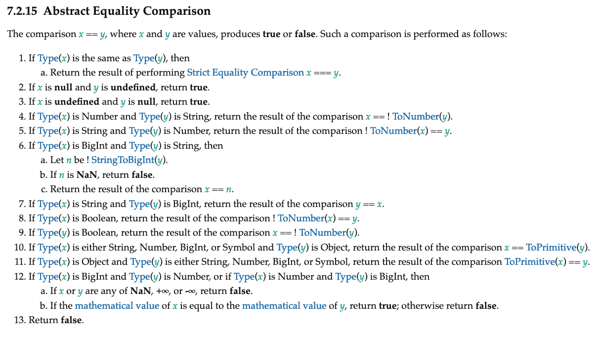

### Introduction
We've all been there. All our life, we've been taught to use the '==' to compare two variables to check if they are
equal. We all remember our professor/teacher giving us the exercise to write a program to get the age of the user and
check if he/she is eligible for voting.

After few years, you didn't end up in a job where you code super cool games using
C++ like you wanted(ignore the personal rant) or write those cool Java code that runs on 3 billion devices. You instead end up being a web developer.

You start your first day at work writing JS, you want to compare two variables. You use the '==' operator.
I mean why wouldn't you? But then your lead engineer/architect reviews your code and goes, *No! No! No! we don't
do the '==' business here*. He didn't tell you why though or maybe you are afraid to ask or maybe you didn't understand
what he told. We've all been there.

### The classic '==' joke
You get back to your seat. Still wondering why can't you use '==' and more importantly, what the hell is this '==='
operator. Down goes couple years. you are a constant victim of developers of other languages mocking you for how dumb
JS is and keep throwing at you the classic '==' joke.

For those who are lucky enough to not be mocked by this joke, here it is.


```js
'' == '0'            // false
'' ==  0             // true
0  == '0'            // true

false == undefined   // false
false == null        // false
null  == undefined   // true
```

Alright. There's a lot to unpack here. Nothing makes sense. Any person with common sense will go *dafaq's this?*.
This post tries to explain what the hell is going on here.

### Spec is The Bible
As far as today's JS is concerned, The only book you ever need for your afterlife is the [ECMAScript Specification](https://www.ecma-international.org/publications/files/ECMA-ST/ECMA-262.pdf).
The spec is your Bible, the spec is your friend, the spec is a blessing by the Gods of Olympus. So today we will see
what the Spec say about the equality operator.

#### Abstract Operations
Before diving into the actual algorithm, lets try to understand what abstract operations are. Abstract operations are
well... abstract. They mean a concept but not particularly an implementation. So assume there is an abstract operation
called

```js
makeSambhar()
```

The above abstract operation, although look like a function, is not really a function. It is represented like function
because its easy to write. But it just means *makeSambhar is an operation that somehow makes sambhar for us*

So when you  look up the spec for a JS function, (e.g) `Food.Prototype.makeSambharSadham()`

the algorithm might look something like this.


* let *r* be the result of `makeSaadham(Rice)`.
* let *s* be the result of `makeSambhar(dhaal, onion, sambharPowder, corianderLeaves)`.
* `return` `mixRiceAndSadham(r,s)`


in the above algorithm, `makeSaadham`, `makeSambhar` and `mixRiceAndSadham` are abstract operations which are not
of interest in the current algorithm as long as we got saadham and sambhar and mix them together properly. These
operations might be implemented differently in each JS Engine, based on a lot of other things. But the spec guarantee
that when you call `makeSambharSadham()`, we first make the saadham, then the sambhar and then mix them together and
return the sambarSaadham. That is all that matters.

The function like syntax is just for ease of writing/printing. The algorithm might very well be written like this

* make sadham first using rice.
* make sambhar using dhaal, onion, sambharPowder, corianderLeaves.
* return a good bowl of saadham and sambhar mixed into a sambhar sadham.

now ask yourself.

* does it matter if the sambhar is cooked on a electric stove or a gas stove or just with a bunch of coal and fire?
* does it matter if the rice was cooked in a pressure cooker or in old style water and vessel(filtering method)

no right? so it can be abstract as long it gets the job done.

The reason I'm explaining the abstract operations this much is because in our next section, the algorithm is filled with
such abstract operations and you should not confuse them with real functions getting called all over the places.

## Abstract Equality Comparison
The alogirthm of Abstract Equality operation is given in [ECMAScript Specification section 7.2.15](http://www.ecma-international.org/ecma-262/#sec-abstract-equality-comparison).
What it says is,



Woah! thats a lot of steps. lets break it down bit by bit. Before that lets identify the abstract operations here. We got
`Type()` which gets us the type of the variable, we got `ToNumber()` which converts a given value into a number.
Similarly we got `toPrimitive()` which converts an object into a primitive value. These operation's detailed
mechanisms can be found on the spec itself but that's a discussion for another day.

Now the easiest step is Step **1**.  if `Type(x)` and `Type(y)` are same, perform ===. which means,

```js
2 == 2
'ragzzy' == 'ragzzy'
```
and
```js
2 === 2
'ragzzy' === 'ragzzy'
```

are the same.

Step **2** and **3** can be boiled down to, if either of the value is `null` while the other is `undefined`, then return **true**

```js
null == undefined
undefined == null
```
both are **true**

Now going forward things get a bit complicated. Step **4** addresses the scenario where *x* is a number while *y* is a
string. If that's the case, then convert *y* to number, then repeat the comparison process.(i.e) start again at step 1.

Step **5** covers the scenario where x is a String and y is a number. If thats the case, then convert x to a number and
perform the comparison process again.

Before going any further. You might have already noticed how the algorithm is always preferring to keep things as
numbers. So lets take a step back and think about it. So if one of the value is a number while the other is not, the
algorithm prefers the latter to be a number too and performs a ToNumber() on it.

moving on, I'm going to skip Step **6** and **7**, because they deal with BigInt's which is not yet widely implemented.
Moreover, we already have enough type of values to worry about. So its a good exercise for you to try and understand how
its done for BigInts on your own.

Step **8** and **9** are for scenario if one of the values are boolean. In that case, again we see how the algorithm is
number greedy. So it converts the boolean values to number (**true** becomes 1 and **false** become 0) and goes back to
do the comparison again.

Step **10** and **11** are to deal with objects. If the algorithm encounters an object on either of the values, it performs
the `toPrimitive` abstract operation and try to convert it to a primitive type(like number, string etc) and then performs
the comparions again.

Step **12** is again for BigInt and Number scenario. its pretty straight forward so I'm going to leave it as is.

and finally, if none of these scenario's satisfies, just return **false**

Note that if one of the values is **NaN**, then its always false. even if its `NaN == NaN`. this is same for `===` too.
More on this in the bottom.


### Back to the '==' joke

Phew! that's a lot of technical stuff. I suggest you try to read it more than once slowly and try to get the grasp of it
and try it out with few examples.

But wait.. what about that joke? Isn't that why you guys stayed this far? Now that we know the algorithm, lets try it
on the examples on the joke and see how JS fares. lets take the first one,


 ```js
  '' == '0'
 ```
 okay so lets start with the algorithm.

 ##### Iteration 1
 * `x = ''` `y = '0'`
 * Type(x) is string and Type(y) is string, We've hit a condition. Now by Step 1, we just do `x === y`. so `'' === '0'` is **false**.

 now lets do the second one.
```js
'' == 0
```

##### Iteration 1
 * `x = ''`, `y = 0`
 * Type(x) is string and Type(y) is number. Hence they are not equal so we rule out Step 1.
 * none of the two values are null or undefined, so we rule out step 2 and 3.
 * according to step 4, x should be Number and y should be string. which is not true. so we ignore that case.
 * in step 5, x should be string and y should be a number. Wait. we just hit the right condition. So what we do?  we do
 a toNumber(x) so a toNumber('') returns a 0. (don't ask why for now. its abstract remember? thats a post for another day.)
 so now after conversion we again go to step1. (because the step said, do ToNumber(x) == y);

##### Iteration 2
 * x = 0, y = 0 (x got converted to 0 from toNumber('') in previous iteration remember?).
 * Type(x) is number and Type(y) is number. Voila we hit a condition. So now we just do `x === y`. so `0 === 0` is **true**.


Now you get the flow. Right? go on and do the same for the other ones.


Now you know how the algorithm works. You can be confident now on using '=='.  You don't need to blindly follow a lint
rule or just not use '==' because *no one uses ==*

that's the kind of confidence you get when you have a strong understanding of the underlying language. So All hail Spec!


#### About NaN

Many people I've seen complain that it is stupid that `NaN === NaN` or `NaN == NaN` is **false**. This is not a thing
that is specific to JS. A lot of languages does this. This is because the standards for floating point arithmetic
treats it that way in its spec [IEEE 754](https://en.wikipedia.org/wiki/IEEE_754). One way I remember this is, assume the following
example,

```js
const x = toNumber('Banana'); //NaN because you cant convert banana to a number silly.
const y = toNumber('Apple'); // NaN duh!

if(x == y) { // NaN == NaN ?
 console.log("That can't be right");
}
```

The reason this distinction is important is, you might want to check for NaN's in your programs. let's make a full circle
by getting back to the program our professors gave as assignment. Find if a person is eligible for voting. But lets do
it in JS this time.

```js
const age = getAgeFromInputBox();
const ageInNumber = Number(age); /* because we got string from inputBox */
if(ageInNumber != NaN) // or (ageInNumber !== NaN) {
 if(ageInNumber > 18) {
  alert('eligible for voting');
 }
}
```

the problem with the above code is, it will never get past the NaN check. because NaN === NaN is false. To fix this,
JS provides a method [isNaN()](https://developer.mozilla.org/en-US/docs/Web/JavaScript/Reference/Global_Objects/isNaN).

rewriting the above program.

```js
const age = getAgeFromInputBox();
const ageInNumber = Number(age); /* because we got string from inputBox */
if(!isNaN(ageInNumber))
 if(ageInNumber > 18) {
  alert('eligible for voting');
 }
}
```

fixes the issue.

I can hear you saying, all these explanation are good but I can't think of all of that when im writing a piece of code
and I can't memorize everything that the algorithm is doing. So to boil all of this into a sticky note,

* If the type of two values are same, just do ===.
* If either of the value is null while the other is undefined, return true.
* If one of the values' type is Number while the other is not, convert the non-number to number and iterate.
* If one of the values' type is Object, convert that object to a primitive value and iterate.
* If none of the conditions hold true, return false.


Also, you can always google the spec up if you want to be absolutely sure.


That's it for today. That's a lot of material to cover. So it's fine if you don't get it in one go. read it and re-read
it. read the spec, try out things by writing a few scenarios and compare them. It is very rewarding once you get the
hang of it.

Ragzzy out!